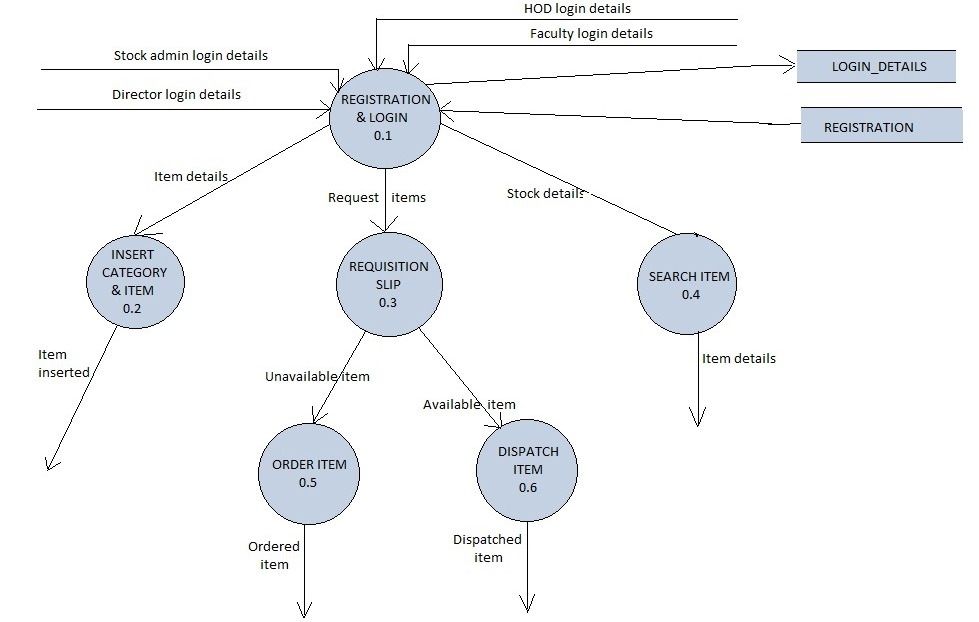

# TotalStockManagementSystem
## Description:
Total Stock Management System is the practice of ordering, storing, tracking, and controlling in-out stock of any organization by the use of information technologies.The purpose of this software is to maintain the stock of our college. The main advantage of this software is that it is robust, responsive, user friendly and also an hybrid application.
## Technology Used:
- XAMPP server
- PHP
- MySQL
- HTML
- CSS
- Bootstrap
- JavaScript
- jQuery
## Use Case Diagram:

## Data Flow Diagram:
### Level-0

### Level-1

### Level-2, Registration and Login

### Level-2, Insert Category And Add Item

### Level-2, User Requisition

### Level-2, Departmental Requisition

## E-R Diagram:

